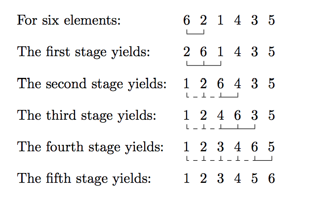

## [Source 1](https://www.cl.cam.ac.uk/teaching/0809/LongVac/problems.pdf)
2. Greenfly can reproduce asexually. 
```
After one week of life a lone female can produce eight
offspring a day. Starting at the beginning of day 1 with a single mature female, how many
greenfly could there be by the end of day 28? It may be assumed that:
* There are no deaths
* All offspring are females
Example:

Note that at the end of day 1 there will be 9 greenfly (original + 8 offspring). At the end
of day 7 there will be 57 greenfly (original + 8 × 7 offspring). At the end of day 8 there
will be 129 greenfly (original + 8 × 8 offspring + 64 offspring from the daughters produced
on day 1).
```

3. All Prime Numbers less than 600
```
Write a program to print a table of all prime numbers less than 600. Use the sieve method;
take the first 600 integers and cross out all those that are multiples of 2, 3, 5, etc. until only
primes remain, then print out the table. The table must be organised so that there are
ten prime numbers on each line. The start of the program should resemble the following:
```

4. A Sort Problem
```
Write a program which incorporates a method sort to ‘sort by exchange’ the elements of
an array. An appropriate program to sort six numbers of type int into ascending order
might:
The call sort(vec) should sort the elements vec[0], vec[1], . . . vec[5] into ascending
order.
Roughly speaking the algorithm should be as follows:
• The first pair of elements is dealt with.
• The 2nd then 1st pair of elements are dealt with.
• The 3rd then 2nd then 1st pair of elements are dealt with.
• The 5th, 4rd, . . . 1st pair of elements are dealt with.
Here, ‘dealing with’ means exchanging the elements if they are the wrong way round and
abandoning the entire stage if they are all right.
```


5. The Date of Easter Problem
7. The Forward and Backward Count Problem
11. Sorting Records


## [Source 2](http://www.iitk.ac.in/esc101/share/downloads/javanotes5.pdf)

#### Exercises for Chapter 3
1. How many times do you have to roll a pair of dice before they come up snake eyes? You
   could do the experiment by rolling the dice by hand. Write a computer program that
   simulates the experiment. The program should report the number of rolls that it makes
   before the dice come up snake eyes. (Note: “Snake eyes” means that both dice show a
   value of 1.) 
   
2. Which integer between 1 and 10000 has the largest number of divisors, and how many
   divisors does it have? Write a program to find the answers and print out the results. It is
   possible that several integers in this range have the same, maximum number of divisors.
   Your program only has to print out one of them. 
   
#### Exercises for Chapter 4
1. To “capitalize” a string means to change the first letter of each word in the string to upper
   case (if it is not already upper case). For example, a capitalized version of “Now is the time
   to act!” is “Now Is The Time To Act!”. Write a subroutine named printCapitalized
   that will print a capitalized version of a string to standard output. The string to be printed
   should be a parameter to the subroutine. 
   
2. The hexadecimal digits are the ordinary, base-10 digits ’0’ through ’9’ plus the letters ’A’
   through ’F’. In the hexadecimal system, these digits represent the values 0 through 15,
   respectively. Write a function named hexValue that uses a switch statement to find the
   hexadecimal value of a given character. The character is a parameter to the function, and
   its hexadecimal value is the return value of the function. You should count lower case
   letters ’a’ through ’f’ as having the same value as the corresponding upper case letters.
   If the parameter is not one of the legal hexadecimal digits, return -1 as the value of the
   function.
   Write a program that reads a string from the user. If all the characters in the string are
   hexadecimal digits, print out the corresponding base-10 value. If not, print out an error
   message.
   
3. Write a function that simulates rolling a pair of dice until the total on the dice comes up
   to be a given number. The number that you are rolling for is a parameter to the function.
   The number of times you have to roll the dice is the return value of the function. The
   parameter should be one of the possible totals: 2, 3, . . . , 12. The function should throw
   an IllegalArgumentException if this is not the case.
   
## Other sources
1. Provided that you have a given number of small rice bags (1 kilo each) and big rice bags (5 kilo each), 
write a method that returns true if it is possible to make a package with goal kilos of rice.